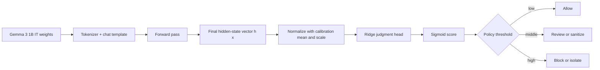
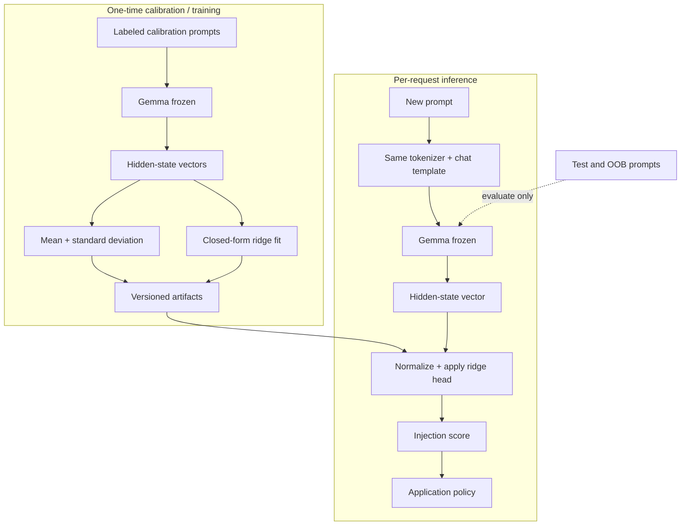
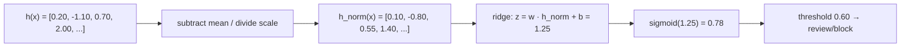
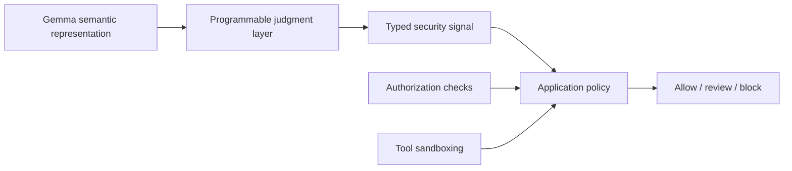

# Approach: Gemma 3 1B to prompt-injection judgment

## Objective

The goal is to turn a general-purpose language model into a local prompt-injection screening component. Given text, the component produces an injection score that an application can use to allow, review, sanitize, isolate, or block the input.

The component does not generate the application's answer. It makes a security judgment about the input before the application passes that input to an assistant or agent.

## End-to-end flow

```text
Gemma 3 1B IT weights
        ↓
Tokenizer + Gemma chat template
        ↓
Gemma forward pass with weights frozen
        ↓
Final hidden-state vector
        ↓
Calibration normalization
        ↓
Closed-form ridge classification head
        ↓
Sigmoid injection score
        ↓
Policy decision: allow / review / block
```

### Visual pipeline



The diagram separates the semantic model from the decision layer: Gemma produces features, while the small head converts those features into a programmable security judgment.

### Training and inference are separate



The executable implementation is mapped here:

- [Dataset preparation](prepare_gemma1b_dataset.py#L8-L28) downloads the deepset data, filters English rows, and creates the disjoint splits.
- [Model and tokenizer loading](evaluate_gemma1b.py#L8-L14) loads the local Gemma 3 1B IT checkpoint and selects MPS or CPU.
- [Prompt rendering and hidden-state extraction](evaluate_gemma1b.py#L16-L22) applies the chat template and returns the final hidden-state vector.
- [Ridge-head fitting](evaluate_gemma1b.py#L31-L36) standardizes calibration vectors and solves the closed-form ridge system.
- [Scoring](evaluate_gemma1b.py#L38-L42) applies the head and sigmoid to produce the injection score.
- [Metrics and benchmark output](evaluate_gemma1b.py#L43-L55) calculates threshold metrics and writes the evaluation summary.
- [Giskard evaluation](evaluate_giskard.py#L12-L42) reuses the same calibration procedure and measures positive-only attack recall and latency.

## 1. Starting with Gemma 3 1B IT

We use the local `google/gemma-3-1b-it` checkpoint. The tokenizer and model are loaded once, normally onto Apple Silicon MPS on the development Mac. The model weights are not changed during evaluation or inference.

For each input, we apply the same user-message chat template used during calibration. The tokenized prompt is passed through Gemma with hidden-state output enabled. We use the final token's representation from the final hidden layer as a fixed numerical representation of the input.

Formally, for text `x`, Gemma produces a vector:

```text
h(x) ∈ R^d
```

An actual Gemma vector has many dimensions. The following is a small illustrative example, not the complete model output:



In code, the corresponding operations are visible in [`evaluate_gemma1b.py`](evaluate_gemma1b.py#L32-L42): the vector is standardized, a bias feature is appended, the ridge weights are applied, and the sigmoid produces the score.

This vector contains semantic features learned by Gemma, while the classifier trained in this experiment learns how those features correlate with prompt-injection labels.

## 2. Calibration data

The source dataset is `deepset/prompt-injections`. We filter for English rows using a deterministic seed, then create disjoint stratified splits:

- 150 calibration examples: 84 safe and 66 injection;
- 100 test examples: 56 safe and 44 injection;
- 101 OOB examples: 57 safe and 44 injection.

The [calibration split](data/gemma1b-prompt-injections/calibration/) is used only to fit the lightweight judgment head and its normalization statistics. The [test split](data/gemma1b-prompt-injections/test/) and [OOB split](data/gemma1b-prompt-injections/oob/) are not used during fitting.

For the calibration vectors, we compute a per-dimension mean and standard deviation. Each hidden-state vector is standardized using those saved values. This prevents large-scale dimensions from dominating the linear head.

## 3. The learned judgment head

After normalization, we append a bias feature and fit a ridge-regression head against the binary labels. The implementation is in [`evaluate_gemma1b.py`](evaluate_gemma1b.py#L31-L42). In simplified form:

```text
z(x) = w · normalize(h(x)) + b
score(x) = sigmoid(z(x))
```

The ridge solution is computed in closed form. It is a small supervised model trained on top of Gemma's representations; Gemma itself remains frozen.

The resulting `score(x)` is called `probability_injection` in the evaluation output. It is a model score used for ranking and thresholding. It should not be interpreted as a perfectly calibrated real-world probability until calibration has been checked on a representative validation set. The production integration guidance is in [`SHIPMENT_GUIDE.md`](SHIPMENT_GUIDE.md).

## 4. Programmable judgment layer

The design separates a large model's semantic representation from a compact, programmable judgment layer. Gemma provides the representation, and a downstream component turns it into a binary security judgment and confidence score.

In this experiment:

- Gemma supplies the semantic representation;
- the downstream head supplies the binary judgment;
- the output is a score that can be composed with application policy.

We did not fine-tune Gemma, run reinforcement learning, run RLCD, or run GRPO. We implemented the judgment layer explicitly with a frozen final hidden state and a closed-form ridge head.

Therefore, the most precise description is:

> A frozen Gemma 3 1B encoder with a programmable security judgment layer implemented as a supervised ridge classifier.

### Separation of concerns



The separation between representation and judgment is implemented by the ridge head shown in [`evaluate_gemma1b.py`](evaluate_gemma1b.py#L31-L42).

## 5. From score to application output

The model score is not itself the final user-facing output. An application policy maps the score to an action:

```text
low score       → allow
borderline      → monitor, sanitize, or secondary check
high score      → review, isolate, or block
```

The tested operating point was approximately `0.6`. On the deepset test split it achieved 95.45% recall and 93.33% precision. On the external 35-row Giskard positive-only set, it detected 35/35 attacks at threshold `0.6` and 34/35 at `0.7`.

The Giskard set contains no benign examples, so it can measure attack recall but cannot establish precision, accuracy, or F1.

## 6. What this approach is and is not

This is:

- frozen-feature transfer learning;
- linear probing with a ridge head;
- supervised binary classification;
- a local semantic screening component;
- a programmable judgment layer.

This is not:

- Gemma fine-tuning;
- LoRA or QLoRA;
- reinforcement learning;
- RLHF, RLCD, or GRPO;
- a generative prompt-rewriting system;
- a complete authorization or agent-safety system.

## 7. Production interpretation

The detector should be placed before model generation and before high-risk tool execution. Scan user prompts, retrieved content, uploaded documents, tool outputs, and tool arguments where applicable. Keep authorization and least-privilege checks independent from the injection score.

For production, save and version together:

- the exact Gemma model revision;
- tokenizer and chat-template configuration;
- calibration mean and scale;
- ridge weights and bias;
- calibration dataset revision;
- threshold and policy version;
- evaluation results.

Any change to the model, prompt template, truncation length, calibration data, or policy threshold should trigger a new evaluation and model version.

## Summary

We use Gemma 3 1B IT as a frozen semantic encoder. We convert its final hidden state into a compact representation, fit a ridge head on labeled calibration examples, and turn the head output into an injection score. The score is then consumed by an application policy.

The concrete implementation in this repository is an explicit frozen-encoder-plus-ridge design, not fine-tuning of Gemma.
